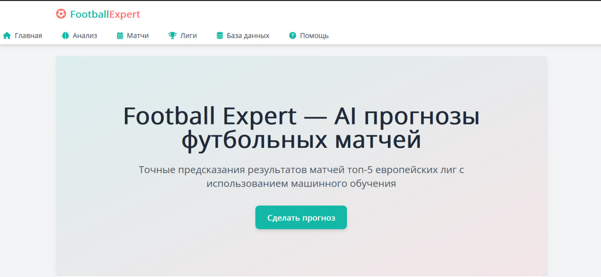
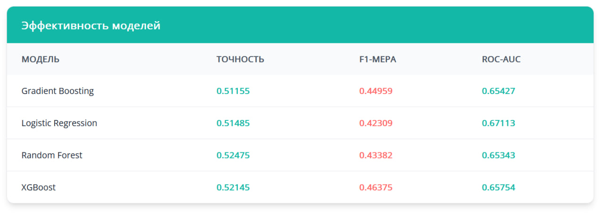
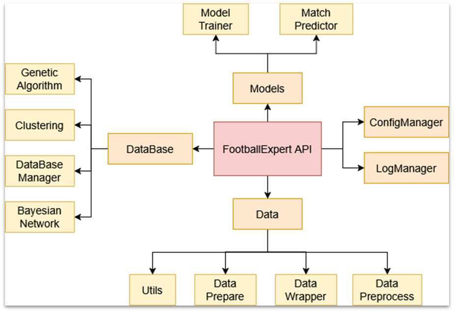

<div align="center">
  
# Football Expert ⚽
</div>

## Прогнозирование результатов футбольных матчей с использованием машинного обучения 🤖📈


---

## Содержание 📚

1. [Описание проекта](#описание-проекта)
2. [Установка](#установка)
3. [Использование](#использование)
4. [Сбор данных](#сбор-данных)
5. [Подготовка данных](#подготовка-данных)
6. [Обучение модели](#обучение-модели)
7. [API](#api)
8. [Telegram-бот](#telegram-бот)
9. [Веб-приложение](#веб-приложение)
10. [Тестирование и валидация](#тестирование-и-валидация)
11. [Дополнительные задачи](#дополнительные-задачи)

---

## Описание проекта 🏆

Проект реализован в несколько этапов:

1. **Сбор данных** 📥 — данные о футбольных матчах собираются через API FBref и SoFIFA ([soccerdata](https://pypi.org/project/soccerdata/)).

2. **Подготовка данных** 🧹 — предварительная обработка: удаление пропусков, кодирование признаков, нормализация.

3. **Обучение модели** 🤖 — использование алгоритмов: логистическая регрессия, случайный лес, градиентный бустинг и XGBoost.

4. **API** 🔌 — API для взаимодействия с моделью и аналитикой.

5. **Telegram-бот** 🤖 — удобный интерфейс для получения прогнозов.

6. **Веб-приложение** 💻 — визуализация данных и интерактивные прогнозы через Flask.

---

## Установка 🛠️

Для установки и запуска проекта выполните следующие шаги:

1. Клонируйте репозиторий:

   ```bash
   git clone https://github.com/rekvizitt/football_expert.git
   cd football-expert
   ```

2. Создайте виртуальное окружение и установите зависимости:

   ```bash
   python -m venv venv
   .\venv\Scripts\activate
   pip install -r requirements.txt
   ```

3. Настройте переменные окружения и конфигурационные файлы.

---

## Использование 🎮

### Запуск Telegram-бота 📲

1. Убедитесь, что у вас есть токен Telegram-бота.
2. Запустите бота:
   ```bash
   python -m src.app.telegram_bot
   ```

### Запуск веб-приложения 🌐

1. Запустите Flask-приложение:
   ```bash
   python -m src.app.flask_app
   ```
2. Перейдите по адресу `http://localhost:5000`.



---

## Сбор данных 📊

Данные собираются через API FBref и SoFIFA. В набор входят:

- Статистика команд.
- Исторические результаты.
- Турнирные таблицы.

---

## Подготовка данных 🧹

Этапы подготовки:

- Удаление пропущенных значений.
- Кодирование категориальных признаков.
- Нормализация числовых данных.

---

## Обучение модели 🤖

Используемые алгоритмы:

- Логистическая регрессия.
- Случайный лес.
- Градиентный бустинг.
- XGBoost.



---

## API 🔄

API предоставляет:

- Доступ к прогнозам.
- Аналитику матча.
- Возможность интеграции в другие сервисы.



---

## Telegram-бот 📱

Пользователи могут получать прогнозы в Telegram, выбрав нужный матч.

---

## Веб-приложение 🖥️

Flask-приложение позволяет:

- Смотреть детальную статистику.
- Получать рекомендации.
- Визуализировать данные (графики, диаграммы).

---

## Тестирование и валидация ✅

Проведено тестирование всех компонентов системы. Модель регулярно обновляется для повышения точности прогнозов.

---

## Дополнительные задачи 🧩

- База данных для хранения информации.
- Система мониторинга качества модели.
- Документация.
- Поддержка нескольких языков.

---

## Заключение 🏁

🎯 Этот проект стремится предоставить пользователям точные и надежные прогнозы футбольных матчей, используя современные методы машинного обучения и удобные интерфейсы взаимодействия.
